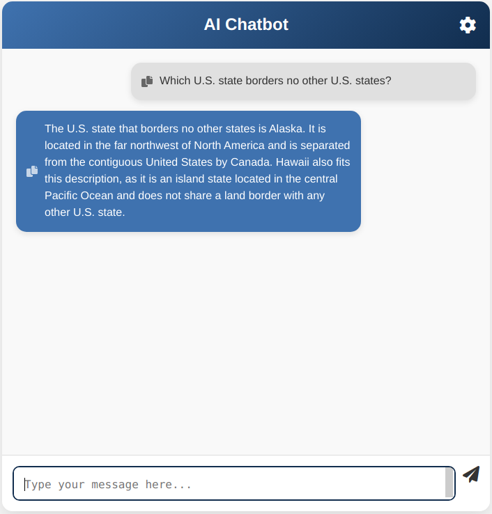
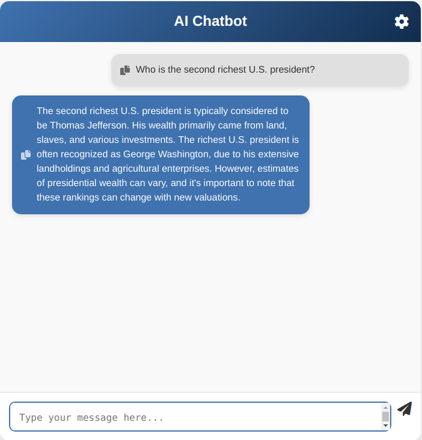

# ChatGPT Web App

A basic web application allows a user to use ChatGPT by interacting with the model's API. 
 
 
## Installation

1. **Clone the repository:**
   ```bash
   git clone https://github.com/tuanhcmut/chatgpt.git
   ```

2. **Navigate to the chatgpt directory:**
   ```bash
   cd chatgpt
   ```

3. **Install dependencies:**
   ```bash
   npm install
   ```

4. **Create/edit the `.env` file:**
   In the root of the project, create or edit a `.env` file and set your OpenAI API key:
   ```plaintext
   OPENAI_API_KEY=your_openai_api_key_here
   ```

## Configuration

1. **Modify the server URL** in the client-side website:
   - Locate the settings icon
   - Make sure the server URL point to your public server/cloud URL.

2. **Customize the model** in `server.js`:
   - Open `server.js` and locate the line where there is a comment: `Use the desired model`.
   - Change the model to your preferred version if needed (default is set to `gpt-4o-mini`).

3. **Save the changes** and ensure the application is reloaded to use the new configuration.

## Usage

To start the server, run:
```bash
node server.js
```
You can access the application at `http://localhost` (or the port in .env file).
Then check the settings icon in the website to make sure your API URL is correct.

## Most important section 
- Check out the POST `/chat` endpoint in `server.js` - This is hightlighted as an important part!


## Test Case Results

Here are the test case results displayed as images:




## Contributing

Contributions are welcome! Please open an issue or submit a pull request.

## License

This project is licensed under the MIT License - see the [LICENSE](LICENSE) file for details.
